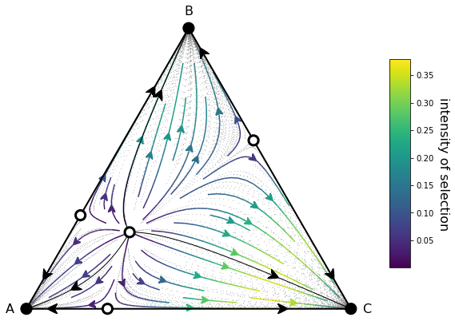

# EGTTools – Evolutionary Game Theory Toolbox

[](https://pypi.org/project/egttools/)
[](https://egttools.readthedocs.io/)
[](https://efernandez.eu/EGTTools/)
[](https://github.com/Socrats/EGTTools/actions/workflows/wheels.yml)
[](https://gitter.im/EGTTools/community?utm_source=badge&utm_medium=badge&utm_campaign=pr-badge)
[](https://mybinder.org/v2/gh/Socrats/EGTTools/HEAD?labpath=docs%2Fexamples)
[](https://zenodo.org/badge/latestdoi/242180332)

EGTTools is a modular toolbox for simulating and analyzing **evolutionary dynamics** in strategic environments. It
combines **analytical methods** (replicator dynamics, fixation probabilities) and **numerical simulations** (Monte Carlo
with parallel C++ backends) under a unified interface.

---

## 📑 Table of Contents

Testing & Continuous Integration

- [Features](#-features)
- [Installation](#-installation)
- [Platform Notes](#-platform-notes)
- [Advanced Configuration](#-advanced-configuration-blas-openmp-vcpkg)
- [Build from Source](#-build-from-source-with-vcpkg)
- [Usage Examples](#-usage-examples)
- [Documentation](#-documentation)
- [Testing & CI](#-testing--continuous-integration)
- [Citation](#-citation)
- [License](#-license)
- [Acknowledgements](#-acknowledgements)
- [Caveats](#-caveats)

## 🚀 Features

- ✅ Replicator dynamics for 2-strategy and N-player games
- ✅ Stochastic dynamics using the pairwise comparison rule
- ✅ Numerical simulation of evolutionary processes in finite populations
- ✅ Monte Carlo estimation of fixation probabilities and strategy distributions
- ✅ OpenMP parallelization for large-scale simulations (Linux/macOS)
- ✅ Modular game and strategy framework, extensible in both Python and C++
- ✅ Visual tools for plotting gradients, stationary distributions, and simplex diagrams
- ✅ Support for Boost, Eigen, and BLAS integration (configurable)
- ✅ Cross-platform wheels (Linux, macOS, Windows; x86_64 and ARM64)

## 📦 Installation

EGTTools is distributed via PyPI and includes prebuilt wheels for major platforms:

| Platform        | Architectures         | Python Versions | OpenMP Supported |
|-----------------|-----------------------|-----------------|------------------|
| Linux (x86_64)  | x86_64                | 3.10 – 3.12     | ✅ Yes            |
| macOS (x86/arm) | x86_64, arm64 (M1/M2) | 3.10 – 3.12     | ✅ Yes            |
| Windows         | x86_64, arm64         | 3.10 – 3.12     | ❌ Not available  |

### ▶️ Install with pip

```bash
pip install egttools
```

For a more reliable installation on macOS with conda-based environments:

conda install numpy scipy matplotlib networkx seaborn
pip install egttools --no-deps

---

## 🖥️ Platform Notes

### 🐧 Linux

- OpenMP is fully supported and enabled by default.
- Wheels are built with optimized BLAS/LAPACK and Boost.
- Recommended for high-performance simulation runs.

### 🍎 macOS (Intel or Apple Silicon)

- Supported on both `x86_64` and `arm64`.
- OpenMP is enabled by default and linked via `libomp`.
- If using `conda`, prefer `miniforge` or `mambaforge` for ABI compatibility.
- To skip dependency resolution and control packages manually:

```bash
pip install egttools --no-deps
conda install numpy scipy matplotlib networkx seaborn
````

### 🪟 Windows (x86_64 and ARM64)

- Windows wheels are available for both Intel and ARM architectures.
- OpenMP is currently not available on Windows.
- Simulations will fall back to single-threaded mode.
- BLAS/LAPACK can be enabled via conda or system libraries if building from source.

---

## ⚙️ Advanced Configuration (BLAS, OpenMP, vcpkg)

The C++ backend of EGTTools supports several build-time options that can be toggled when building from source:

| Feature       | CMake Option               | Default          | Description                                     |
|---------------|----------------------------|------------------|-------------------------------------------------|
| OpenMP        | `-DEGTTOOLS_USE_OPENMP=ON` | ON (Linux/macOS) | Enables parallel computation for simulations    |
| BLAS/LAPACK   | `-DEGTTOOLS_USE_BLAS=ON`   | OFF              | Enables matrix acceleration (e.g., OpenBLAS)    |
| Use vcpkg     | `-DEGTTOOLS_USE_VCPKG=ON`  | ON               | Automatically fetches Boost and Eigen           |
| Disable vcpkg | `-DEGTTOOLS_USE_VCPKG=OFF` |                  | Allows using system-provided libraries manually |

### 🧰 When to disable vcpkg

You may want to disable `vcpkg` in CI environments or when using a distribution that provides all necessary dependencies
system-wide. To do this:

```bash
cmake -DEGTTOOLS_USE_VCPKG=OFF .
```

In this case, you are responsible for ensuring that compatible versions of Boost and Eigen are available in your system
paths.

---

## 🔧 Build from Source (with vcpkg)

To build EGTTools from source with all dependencies managed via `vcpkg`, run:

```bash
git clone --recurse-submodules https://github.com/Socrats/EGTTools.git
cd EGTTools
pip install .
```

To configure optional features manually, such as OpenMP or BLAS support:

```bash
cmake -DEGTTOOLS_USE_OPENMP=ON -DEGTTOOLS_USE_BLAS=ON -DEGTTOOLS_USE_VCPKG=OFF .
make
```

If using `conda`, make sure to activate your environment first and ensure that Python, NumPy, and compiler toolchains
are compatible.

---
## 🧪 Usage Examples

### Calculate Gradient of Selection

```python
from egttools.analytical import PairwiseComparison
from egttools.games import Matrix2PlayerGameHolder

A = [[-0.5, 2], [0, 0]]
game = Matrix2PlayerGameHolder(2, A)
evolver = PairwiseComparison(100, game)

gradient = evolver.calculate_gradient_of_selection(beta=1.0, state=[10, 90])
```

---

### Estimate fixation probability numerically

```python
from egttools.numerical import PairwiseComparisonNumerical
from egttools.games import Matrix2PlayerGameHolder

A = [[-0.5, 2], [0, 0]]
game = Matrix2PlayerGameHolder(2, A)
numerical_evolver = PairwiseComparisonNumerical(game, population_size=100, cache=1_000_000)
fp = numerical_evolver.estimate_fixation_probability(
    index_invading_strategy=1,
    index_resident_strategy=0,
    nb_runs=500,
    nb_generations=5000,
    beta=1.0
)
```


### More Examples of usage

The [Analytical example](docs/examples/hawk_dove_dynamics.ipynb) is a jupyter notebook which analyses analytically the
evolutionary dynamics in a (2-person, 2-actions, one-shot) Hawk-Dove game.

The [Numerical example](docs/examples/normal_form_game_mc_simulations.ipynb) is a jupyter notebook which analyses
through numerical simulations the evolutionary dynamics in a (2-person, 2-actions, one-shot) Hawk-Dove game.

The [Invasion example](docs/examples/plot_invasion_diagram.ipynb) is a jupyter notebook calculates the fixation
probabilities and stationary distribution of a Normal Form Game with 5 strategies and then plots an invasion diagram.

The [Plot 2 Simplex](docs/examples/plot_simplex.ipynb) is a jupyter notebook that shows how to use EGTtools to plot the
evolutionary dynamics in a 2 Simplex (a triangle), both for infinite and finite populations.

You can also check all these notebooks and a bit more on
this [tutorial repository](https://github.com/Socrats/egt-tutorial)

For example, assuming the following payoff matrix:


You can plot the gradient of selection in a finite population of \(Z=100\) individuals and assuming and intensity of
selection  in the following way:

```python
import numpy as np
from egttools.analytical import PairwiseComparison
from egttools.games import Matrix2PlayerGameHolder

beta = 1;
Z = 100;
nb_strategies = 2;
A = np.array([[-0.5, 2.], [0., 0.]])
pop_states = np.arange(0, Z + 1, 1)

game = Matrix2PlayerGameHolder(nb_strategies, payoff_matrix=A)

# Instantiate evolver and calculate gradient
evolver = PairwiseComparison(population_size=Z, game=game)
gradients = np.array([evolver.calculate_gradient_of_selection(beta, np.array([x, Z - x])) for x in range(Z + 1)])
```

Afterward, you can plot the results with:

```python
from egttools.plotting import plot_gradients

plot_gradients(gradients, figsize=(4, 4), fig_title="Hawk-Dove game stochastic dynamics",
               marker_facecolor='white',
               xlabel="frequency of hawks (k/Z)", marker="o", marker_size=20, marker_plot_freq=2)
```


And you can plot the stationary distribution for a mutation
rate  with:

```python
import matplotlib.pyplot as plt
from egttools.utils import calculate_stationary_distribution

transitions = evolver.calculate_transition_matrix(beta, mu=1e-3)
stationary_with_mu = calculate_stationary_distribution(transitions.transpose())
fig, ax = plt.subplots(figsize=(5, 4))
fig.patch.set_facecolor('white')
lines = ax.plot(np.arange(0, Z + 1) / Z, stationary_with_mu)
plt.setp(lines, linewidth=2.0)
ax.set_ylabel('stationary distribution', size=16)
ax.set_xlabel('$k/Z$', size=16)
ax.set_xlim(0, 1)
plt.show()
```


We can get the same results through numerical simulations. The error will depend on how many independent simulations
you perform and for how long you let the simulation run. While a future implementation will offer an adaptive method to
vary these parameters depending on the variations between the estimated distributions, for the moment it is important
that you let the simulation run for enough generations after it has achieved a steady state. Here is a comparison
between analytical and numerical results:

```python
from egttools.numerical import PairwiseComparisonNumerical
from egttools.games import NormalFormGame

# Instantiate the game
game = NormalFormGame(1, A)
numerical_evolver = PairwiseComparisonNumerical(Z, game, 1000000)

# We do this for different betas
betas = np.logspace(-4, 1, 50)
stationary_points = []
# numerical simulations
for i in range(len(betas)):
    stationary_points.append(numerical_evolver.stationary_distribution(30, int(1e6), int(1e3),
                                                                       betas[i], 1e-3))
stationary_points = np.asarray(stationary_points)
# Now we estimate the probability of Cooperation for each possible state
state_frequencies = np.arange(0, Z + 1) / Z
coop_level = np.dot(state_frequencies, stationary_points.T)
```

Lastly, we plot the results:

```python
from sklearn.metrics import mean_squared_error

mse = mean_squared_error(1 - coop_level_analytical, coop_level)

# Finally, we plot and compare visually (and check how much error we get)
fig, ax = plt.subplots(figsize=(7, 5))
# ax.scatter(betas, coop_level, label="simulation")
ax.scatter(betas, coop_level_analytical, marker='x', label="analytical")
ax.scatter(betas, coop_level, marker='o', label="simulation")
ax.text(0.01, 0.535, 'MSE = {0:.3e}'.format(mse), style='italic',
        bbox={'facecolor': 'red', 'alpha': 0.5, 'pad': 10})
ax.legend()
ax.set_xlabel(r'$\beta$', fontsize=15)
ax.set_ylabel('Cooperation level', fontsize=15)
ax.set_xscale('log')
plt.show()
```


Finally, you may also visualize the result of independent simulations:

```python
init_states = np.random.randint(0, Z + 1, size=10, dtype=np.uint64)
output = []
for i in range(10):
    output.append(evolver.run(int(1e6), 1, 1e-3,
                              [init_states[i], Z - init_states[i]]))
# Plot each year's time series in its own facet
fig, ax = plt.subplots(figsize=(5, 4))

for run in output:
    ax.plot(run[:, 0] / Z, color='gray', linewidth=.1, alpha=0.6)
ax.set_ylabel('k/Z')
ax.set_xlabel('generation')
ax.set_xscale('log')
```


### Plotting the dynamics in a 2 Simplex

EGTtools can also be used to visualize the evolutionary dynamics in a 2 Simplex. In the example bellow, we use the
`egttools.plotting.plot_replicator_dynamics_in_simplex` which calculates the gradients on a simplex given an initial
payoff matrix and returns a `egttools.plotting.Simplex2D` object which can be used to plot the 2 Simplex.

```python
import numpy as np
import matplotlib.pyplot as plt
from egttools.plotting import plot_replicator_dynamics_in_simplex

payoffs = np.array([[1, 0, 0],
                    [0, 2, 0],
                    [0, 0, 3]])
type_labels = ['A', 'B', 'C']

fig, ax = plt.subplots(figsize=(10, 8))

simplex, gradient_function, roots, roots_xy, stability = plot_replicator_dynamics_in_simplex(payoffs, ax=ax)

plot = (simplex.add_axis(ax=ax)
        .draw_triangle()
        .draw_gradients(zorder=0)
        .add_colorbar()
        .add_vertex_labels(type_labels)
        .draw_stationary_points(roots_xy, stability)
        .draw_trajectory_from_roots(gradient_function,
                                    roots,
                                    stability,
                                    trajectory_length=15,
                                    linewidth=1,
                                    step=0.01,
                                    color='k', draw_arrow=True,
                                    arrowdirection='right',
                                    arrowsize=30, zorder=4, arrowstyle='fancy')
        .draw_scatter_shadow(gradient_function, 300, color='gray', marker='.', s=0.1, zorder=0)
        )

ax.axis('off')
ax.set_aspect('equal')

plt.xlim((-.05, 1.05))
plt.ylim((-.02, simplex.top_corner + 0.05))
plt.show()
```



The same can be done for finite populations, with the added possibility to plot the stationary distribution inside the
triangle (see [simplex plotting](docs/examples/plot_simplex.ipynb)
and [simplified simplex plotting](docs/examples/plot_simplex_simplified.ipynb)
for a more in-depth example).

---

## 📚 Documentation

- 📘 API Reference (ReadTheDocs): [https://egttools.readthedocs.io](https://egttools.readthedocs.io)
- 🌍 Live Tutorial & Examples: [https://efernandez.eu/EGTTools/](https://efernandez.eu/EGTTools/)

You can find a full description of available games, strategies, and simulation methods, along with Jupyter notebooks and
real-world use cases.

---

## 🧪 Testing & Continuous Integration

EGTTools uses GitHub Actions for full CI/CD automation:

- 🧱 **`wheels.yml`** builds wheels for all platforms (Linux, macOS, Windows; x86_64 and arm64)
- 📘 **`docs.yml`** builds documentation and deploys it to GitHub Pages and ReadTheDocs
- ✅ Unit tests run with `pytest` and are included in each CI matrix build
- 🧪 Python stub files are auto-generated from `pybind11` bindings for better typing support

To run tests locally:

```bash
pytest tests
```

You can also build and validate docs locally with:

```bash
cd docs
make html
```

---

## 📖 Citation

If you use EGTtools in your publications, please cite it in the following way with bibtex:

```latex
@article{Fernandez2023,
  author = {Fernández Domingos, Elias and Santos, Francisco C. and Lenaerts, Tom},
  title = {EGTtools: Evolutionary game dynamics in Python},
  journal = {iScience},
  volume = {26},
  number = {4},
  pages = {106419},
  year = {2023},
  issn = {2589-0042},
  doi = {https://doi.org/10.1016/j.isci.2023.106419}
}
```

Or in text format:

```
Fernández Domingos, E., Santos, F. C. & Lenaerts, T. EGTtools: Evolutionary game dynamics in Python. iScience 26, 106419 (2023).
```

And to cite the current version of EGTtools you can use:

```latex
@misc{Fernandez2020,
  author = {Fernández Domingos, Elias},
  title = {EGTTools: Toolbox for Evolutionary Game Theory (0.1.12)},
  year = {2022},
  month = {Dec},
  journal = {Zenodo},
  doi = {10.5281/zenodo.7458631}
}
```

Moreover, you may find our article at [here](https://www.cell.com/iscience/pdf/S2589-0042(23)00496-0.pdf).

---

## 📄 License

EGTTools is released under the [GPLv3 or later](LICENSE).

---

## 🙏 Acknowledgements

Developed and maintained by [Elias Fernández](https://efernandez.eu).

* Great parts of this project have been possible thanks to the help of
  [Yannick Jadoul](https://github.com/YannickJadoul) author of
  [Parselmouth](https://github.com/YannickJadoul/Parselmouth)
  and [Eugenio Bargiacchi](https://github.com/Svalorzen) author of [AIToolBox](https://github.com/Svalorzen/AI-Toolbox).
  They are both great programmers and scientists, so it is always a good idea to check out their work.
* EGTtools makes use of the amazing [pybind11](https://github.com/pybind/pybind11). library to provide a Python
  interface for optimized monte-carlo simulations written in C++.

---

## ⚠️ Caveats

- On **Windows**, OpenMP is currently not supported. All simulations will run single-threaded.
- On **macOS**, OpenMP is supported but performance may depend on the installed `libomp`. If using `conda`, make sure `llvm-openmp` is available.
- Wheels are only built for **Python 3.10 – 3.12**.
- Numerical simulations require large RAM allocations when using large population sizes or caching; ensure you configure the `cache` size accordingly.
- Advanced users building from source should ensure Boost, Eigen, and BLAS/LAPACK libraries are compatible with their compiler toolchain.

---