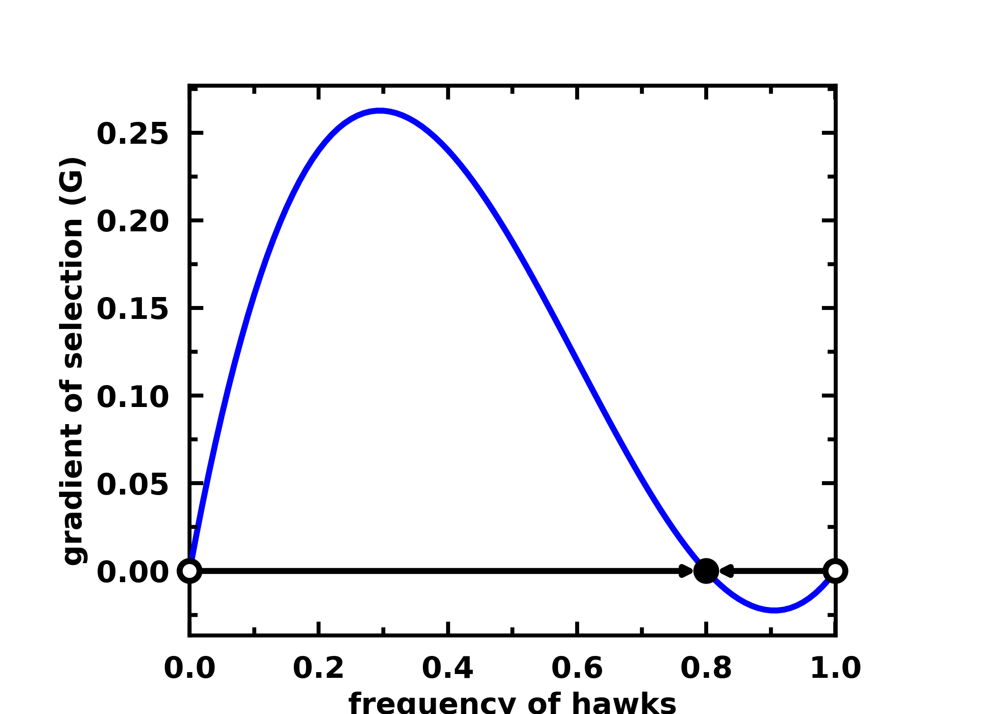

# Toolbox for Evolutionary Game Theory

[](https://badge.fury.io/py/egttools)
[](https://egttools.readthedocs.io/en/latest/?badge=latest)
[](https://github.com/Socrats/EGTTools/actions/workflows/ci.yml) [](https://gitter.im/EGTTools/community?utm_source=badge&utm_medium=badge&utm_campaign=pr-badge&utm_content=badge)
[](https://mybinder.org/v2/gh/Socrats/EGTTools/HEAD?labpath=docs%2Fexamples)
[](https://zenodo.org/badge/latestdoi/242180332)

[//]: # ([![PyPI Downloads]&#40;https://img.shields.io/pypi/dm/egttools.svg?label=PyPI%20downloads&#41;]&#40;https://pypi.org/project/egttools/&#41;)

**EGTtools** provides a centralized repository with analytical and numerical methods to study/model game theoretical
problems under the Evolutionary Game Theory (EGT) framework.

This library is composed of two parts:

- a set of analytical methods implemented in Python 3
- a set of computational methods implemented in C++ with (Python 3 bindings)

The second typed is used in cases where the state space is too big to solve analytically, and thus require estimating
the model parameters through monte-carlo simulations. The C++ implementation provides optimized computational methods
that can run in parallel in a reasonable time, while Python bindings make the methods easily accecible to a larger range
of researchers.

## Table of Contents

1. [Requirements](#requirements)
2. [Downloading sources](#downloading-sources)
3. [Examples of usage](#examples-of-usage)
4. [Documentation](#documentation)
5. [Caveats](#caveats)
6. [Citing](#citing)
7. [Licence](#licence)
8. [Acknowledgements](#acknowledgements)

## Requirements

To be able to install EGTtools, you must have:

* A recent version of Linux (only tested on Ubuntu), MacOSX (Mojave or above) or Windows
* [**CMake**](https://cmake.org) version 3.17 or higher
* [**C++ 17**](https://en.cppreference.com/w/cpp/17)
* [**Eigen**](https://eigen.tuxfamily.org/index.php?title=Main_Page) 3.3.*
* [**Boost**](https://www.boost.org/) 1.80.*
* **Python** 3.7 or higher
* If you want support for parallel operations you should install [**OpenMP**](https://www.openmp.org)
* Ideally, you should also install [**OpenBLAS**](https://www.openblas.net), which offers optimized implementations of
  linear algebra kernels for several processor architectures, and install numpy and scipy versions that use it.

## Downloading sources

When cloning the repository you should also clone the submodules so that pybind11 is downloaded. You can do that by
running:

```bash
git clone --recurse-submodules -j8 https://github.com/Socrats/EGTTools.git
```

## Installation

### With pip

You can install `egttools` directly from PyPi with:

```bash
pip install egttools
```

Currently, only the Linux build supports OpenMP parallelization for numerical simulations. This should normally be ok
for most applications, since numerical simulations are heavy and should be run on High Power Computing (HPC) clusters
which normally run Linux distributions.

We are investigating how to provide support for OpenMP in both Windows and Mac. In the meantime, if you really want to
run numerical simulations on either of the two platforms, you should follow the compilation instructions below and try
to link OpenMP for your platform yourself. Please, if you manage to do so, open an issue or a pull request with your
solutions.

**Note**: For Apple M1 (arm64) you should install using ```pip install egttools --no-deps``` so that pip does not
install the dependencies of the package. You should then install these dependencies through a virtual environment
created with [miniforge](https://github.com/conda-forge/miniforge) (see [Caveats](#caveats) for more information on why
this is necessary). Once you have miniforge installed you can do the following (assuming that you are in the base
miniforge environment):

```bash
conda create -n egtenv python=3.9
conda activate egtenv
conda install numpy
conda install scipy
conda install matplotlib
conda install networkx
conda install seaborn
```

### Build from source

To build `egttools` from source follow the following steps.

To **install all required packages** run:

```bash
python -m venv egttools-env
source egttools-env/bin/activate
pip install -r requirements.txt
```

Or with anaconda:

```bash
conda env create -f environment.yml
conda activate egttools-env
```

Also, to make your virtual environment visible to jupyter:

```bash
conda install ipykernel # or pip install ipykernel
python -m ipykernel install --user --name=egttools-env
```

You can **build EGTtools** in your virtual environment by running:

```bash
pip install build
cd <path>
python -m build
```

Where ```<path>``` represents the path to the EGTtools folder. If you are running this while inside the EGTtools folder,
then ```<path>``` is simply ```./```.

Finally, you can install EGTtools in **development** mode, this will allow the installation to update with new
modifications to the package:

```bash
python -m pip install -e <path>
```

If you don't want development mode, you can skip the option ```-e```.

## Examples of usage

The [Analytical example](docs/examples/hawk_dove_dynamics.ipynb) is a jupyter notebook which analyses analytically the
evolutionary dynamics in a (2-person, 2-actions, one-shot) Hawk-Dove game.

The [Numerical example](docs/examples/normal_form_game_mc_simulations.ipynb) is a jupyter notebook which analyses
through numerical simulations the evolutionary dynamics in a (2-person, 2-actions, one-shot) Hawk-Dove game.

The [Invasion example](docs/examples/plot_invasion_diagram.ipynb) is a jupyter notebook calculates the fixation
probabilities and stationary distribution of a Normal Form Game with 5 strategies and then plots an invasion diagram.

The [Plot 2 Simplex](docs/examples/plot_simplex.ipynb) is a jupyter notebook that shows how to use EGTtools to plot the
evolutionary dynamics in a 2 Simplex (a triangle), both for infinite and finite populations.

You can also check all these notebooks and a bit more on
this [tutorial repository](https://github.com/Socrats/egt-tutorial)

For example, assuming the following payoff matrix:


You can plot the gradient of selection in a finite population of \(Z=100\) individuals and assuming and intensity of
selection  in the following way:

```python
import numpy as np
from egttools.analytical import PairwiseComparison
from egttools.games import Matrix2PlayerGameHolder

beta = 1;
Z = 100;
nb_strategies = 2;
A = np.array([[-0.5, 2.], [0., 0.]])
pop_states = np.arange(0, Z + 1, 1)

game = Matrix2PlayerGameHolder(nb_strategies, payoff_matrix=A)

# Instantiate evolver and calculate gradient
evolver = PairwiseComparison(population_size=Z, game=game)
gradients = np.array([evolver.calculate_gradient_of_selection(beta, np.array([x, Z - x])) for x in range(Z + 1)])
```

Afterwards, you can plot the results with:

```python
from egttools.plotting import plot_gradients

plot_gradients(gradients, figsize=(4, 4), fig_title="Hawk-Dove game stochastic dynamics",
               marker_facecolor='white',
               xlabel="frequency of hawks (k/Z)", marker="o", marker_size=20, marker_plot_freq=2)
```



And you can plot the stationary distribution for a mutation
rate  with:

```python
import matplotlib.pyplot as plt
from egttools.utils import calculate_stationary_distribution

transitions = evolver.calculate_transition_matrix(beta, mu=1e-3)
stationary_with_mu = calculate_stationary_distribution(transitions.transpose())
fig, ax = plt.subplots(figsize=(5, 4))
fig.patch.set_facecolor('white')
lines = ax.plot(np.arange(0, Z + 1) / Z, stationary_with_mu)
plt.setp(lines, linewidth=2.0)
ax.set_ylabel('stationary distribution', size=16)
ax.set_xlabel('$k/Z$', size=16)
ax.set_xlim(0, 1)
plt.show()
```


We can obtain the same results through numerical simulations. The error will depend on how many independent simulations
you perform and for how long you let the simulation run. While a future implementation will offer an adaptive method to
vary these parameters depending on the variations between the estimated distributions, for the moment it is important
that you let the simulation run for enough generations after it has achieved a steady state. Here is a comparison
between analytical and numerical results:

```python
from egttools.numerical import PairwiseComparisonNumerical
from egttools.games import NormalFormGame

# Instantiate the game
game = NormalFormGame(1, A)
numerical_evolver = PairwiseComparisonNumerical(Z, game, 1000000)

# We do this for different betas
betas = np.logspace(-4, 1, 50)
stationary_points = []
# numerical simulations
for i in range(len(betas)):
    stationary_points.append(numerical_evolver.stationary_distribution(30, int(1e6), int(1e3),
                                                                       betas[i], 1e-3))
stationary_points = np.asarray(stationary_points)
# Now we estimate the probability of Cooperation for each possible state
state_frequencies = np.arange(0, Z + 1) / Z
coop_level = np.dot(state_frequencies, stationary_points.T)
```

Lastly, we plot the results:

```python
from sklearn.metrics import mean_squared_error

mse = mean_squared_error(1 - coop_level_analytical, coop_level)

# Finally, we plot and compare visually (and check how much error we get)
fig, ax = plt.subplots(figsize=(7, 5))
# ax.scatter(betas, coop_level, label="simulation")
ax.scatter(betas, coop_level_analytical, marker='x', label="analytical")
ax.scatter(betas, coop_level, marker='o', label="simulation")
ax.text(0.01, 0.535, 'MSE = {0:.3e}'.format(mse), style='italic',
        bbox={'facecolor': 'red', 'alpha': 0.5, 'pad': 10})
ax.legend()
ax.set_xlabel(r'$\beta$', fontsize=15)
ax.set_ylabel('Cooperation level', fontsize=15)
ax.set_xscale('log')
plt.show()
```


Finally, you may also visualize the result of independent simulations:

```python
init_states = np.random.randint(0, Z + 1, size=10, dtype=np.uint64)
output = []
for i in range(10):
    output.append(evolver.run(int(1e6), 1, 1e-3,
                              [init_states[i], Z - init_states[i]]))
# Plot each year's time series in its own facet
fig, ax = plt.subplots(figsize=(5, 4))

for run in output:
    ax.plot(run[:, 0] / Z, color='gray', linewidth=.1, alpha=0.6)
ax.set_ylabel('k/Z')
ax.set_xlabel('generation')
ax.set_xscale('log')
```


### Plotting the dynamics in a 2 Simplex

EGTtools can also be used to visualize the evolutionary dynamics in a 2 Simplex. In the example bellow, we use the
`egttools.plotting.plot_replicator_dynamics_in_simplex` which calculates the gradients on a simplex given an initial
payoff matrix and returns a `egttools.plotting.Simplex2D` object which can be used to plot the 2 Simplex.

```python
import numpy as np
import matplotlib.pyplot as plt
from egttools.plotting import plot_replicator_dynamics_in_simplex

payoffs = np.array([[1, 0, 0],
                    [0, 2, 0],
                    [0, 0, 3]])
type_labels = ['A', 'B', 'C']

fig, ax = plt.subplots(figsize=(10, 8))

simplex, gradient_function, roots, roots_xy, stability = plot_replicator_dynamics_in_simplex(payoffs, ax=ax)

plot = (simplex.add_axis(ax=ax)
        .draw_triangle()
        .draw_gradients(zorder=0)
        .add_colorbar()
        .add_vertex_labels(type_labels)
        .draw_stationary_points(roots_xy, stability)
        .draw_trajectory_from_roots(gradient_function,
                                    roots,
                                    stability,
                                    trajectory_length=15,
                                    linewidth=1,
                                    step=0.01,
                                    color='k', draw_arrow=True,
                                    arrowdirection='right',
                                    arrowsize=30, zorder=4, arrowstyle='fancy')
        .draw_scatter_shadow(gradient_function, 300, color='gray', marker='.', s=0.1, zorder=0)
        )

ax.axis('off')
ax.set_aspect('equal')

plt.xlim((-.05, 1.05))
plt.ylim((-.02, simplex.top_corner + 0.05))
plt.show()
```


The same can be done for finite populations, with the added possibility to plot the stationary distribution inside the
triangle (see [simplex plotting](docs/examples/plot_simplex.ipynb)
and [simplified simplex plotting](docs/examples/plot_simplex_simplified.ipynb)
for a more in depth examples).

## Documentation

The [analytical](src/egttools/analytical/sed_analytical.py) module contains classes and functions that you may use to
investigate the evolutionary dynamics in N-player games. For now only the replicator dynamics (for infinite populations)
and the Pairwise Comparison imitation process (for finite populations) are implemented.

When your state-space is too big (in finite populations), it might become computationally hard to solve the system
analytically. Thus, we provide an efficient [numerical](cpp/src/egttools.cpp) module written in C++ and compiled to
Python. You may use it to estimate the fixation probabilities and stationary distribution through Monte-Carlo
simulations, or perform individual runs of the Moran process.

You can find more information in the [ReadTheDocs](https://egttools.readthedocs.io/en/latest/) documentation.

### Caveats

1. On Apple M1 (arm64) you should install (for the moment) [miniforge](https://github.com/conda-forge/miniforge), create
   a conda environment using it, and install EGTtools from the conda environment.

2. In MacOSX it is assumed that you have [Homebrew](https://brew.sh) installed.
3. You should install libomp with homebrew ``brew install libomp`` if you want to have support for parallel operations (
   there is a big difference in computation time).

4. You **must** have Eigen 3.3.* installed.

5. You **do not** need any of the above if you install EGTtools through ```pip install egttools --no-deps```. However,
   on Apple M1 (arm64) you still need to install the dependencies through miniforge, since only there you can find a
   scipy wheel that supports this architecture.

## Citing

If you use EGTtools in your publications, please cite it in the following way with bibtex:

```latex
@article{Fernandez2023,
  author = {Fernández Domingos, Elias and Santos, Francisco C. and Lenaerts, Tom},
  title = {EGTtools: Evolutionary game dynamics in Python},
  journal = {iScience},
  volume = {26},
  number = {4},
  pages = {106419},
  year = {2023},
  issn = {2589-0042},
  doi = {https://doi.org/10.1016/j.isci.2023.106419}
}
```
Or in text format:

```
Fernández Domingos, E., Santos, F. C. & Lenaerts, T. EGTtools: Evolutionary game dynamics in Python. iScience 26, 106419 (2023).
```

And to cite the current version of EGTtools you can use:

```latex
@misc{Fernandez2020,
  author = {Fernández Domingos, Elias},
  title = {EGTTools: Toolbox for Evolutionary Game Theory (0.1.12)},
  year = {2022},
  month = {Dec},
  journal = {Zenodo},
  doi = {10.5281/zenodo.7458631}
}
```

Moreover, you may find our article at [here](https://www.cell.com/iscience/pdf/S2589-0042(23)00496-0.pdf).

## Licence

* EGTtools is released under the [GNU General Public Licence](LICENSE), version 3 or later.
* [pybind11](https://github.com/pybind/pybind11) is released under [a BSD-style license](pybind11/LICENSE).

## Acknowledgements

* Great parts of this project have been possible thanks to the help of
  [Yannick Jadoul](https://github.com/YannickJadoul) author of
  [Parselmouth](https://github.com/YannickJadoul/Parselmouth)
  and [Eugenio Bargiacchi](https://github.com/Svalorzen) author of [AIToolBox](https://github.com/Svalorzen/AI-Toolbox).
  They are both great programmers and scientists, so it is always a good idea to check out their work.
* EGTtools makes use of the amazing [pybind11](https://github.com/pybind/pybind11). library to provide a Python
  interface for optimized monte-carlo simulations written in C++.
