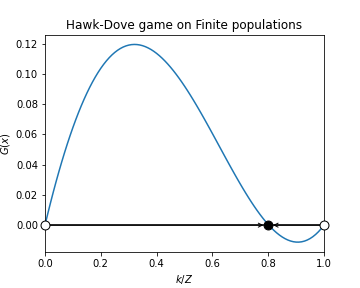
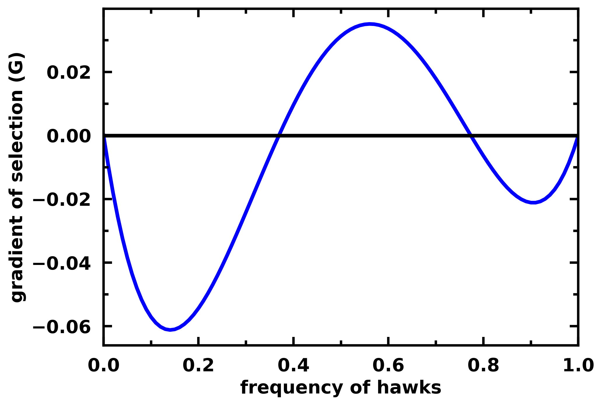

Apply analytical methods
========================

The replicator dynamics
-----------------------

The replicator equation represents the dynamics of competing individuals in an infinite population
(:math:`Z\rightarrow \infty`). It defines the rate at which the frequency of strategies in a population will change, i.e.,
it defines a gradient of selection :cite:p:`santosRiskCollectiveFailure2011`. It is often found in the form of
:cite:p:`Sigmund2010b`

.. math::
    \dot x_{i} = x_{i} \left(f_i(\vec{x})-\sum_{j=1}^{N}{x_{j}f_j(\vec{x})}\right)

where :math:`x_i` represents the frequency of strategy :math:`i` in the population,
and :math:`f_i(\vec{x})=\Pi_i(\vec{x})` its fitness (or expected payoff), given the current population state
:math:`\vec{x}`. The term :math:`\sum_{j=1}^{N}{x_{j}f_j(\vec{x})}` represents the average fitness of
the population in state :math:`\vec{x}`.

EGTtools implements the replicator equation for 2 and N-player games in the functions `egttools.analytical.replicator_equation`
and `egttools.analytical.replicator_equation_n_player`. **Both methods require a payoff matrix as argument. For
2-player games, this payoff matrix must be square and have as many rows (columns) as strategies in the population.
For N-player games, the payoff_matrix reads as the payoff of the row strategy at the group configuration given
by the index of the column.** The group configuration can be retrieved from the index using
`egttools.sample_simplex(index, group_size, nb_strategies)`, where `group_size` is the size of the group (N) and
`nb_strategies` is the number of available strategies in the population.

2-player games
^^^^^^^^^^^^^^

For a 2 player hawk-dove game, you can calculate the gradients of selection, the roots and their stability
with:

.. code-block:: Python

    import numpy as np
    import egttools as egt
    from egttools.analytical.utils import (calculate_gradients, find_roots, check_replicator_stability_pairwise_games, )

    # Calculate gradient
    payoffs = np.array([[-0.5, 2.], [0., 0]])
    x = np.linspace(0, 1, num=101, dtype=np.float64)
    gradient_function = lambda x: egt.analytical.replicator_equation(x, payoffs)
    gradients = calculate_gradients(np.array((x, 1 - x)).T, gradient_function)

    # Find roots and stability
    roots = find_roots(gradient_function, nb_strategies=2, nb_initial_random_points=10, method="hybr")
    stability = check_replicator_stability_pairwise_games(roots, A)

    # Plot the gradient
    egt.plotting.plot_gradients(gradients[:, 0], xlabel="frequency of hawks", roots=roots, stability=stability)

You can then plot the gradient of selection with:

.. code-block:: Python

    egt.plotting.plot_gradients(gradients[:, 0], xlabel="frequency of hawks", roots=roots, stability=stability)

You can find other examples :doc:`here <../examples>`.

N-player games
^^^^^^^^^^^^^^

When :math:`N>2`, the game is played among groups of more than 2 players. In this case,
to analyse the replicator dynamics, we need to use `egt.analytical.replicator_equation_n_player` instead.

For example for a 3-player Hawk-Dove game we have:

.. code-block:: Python

    payoff_matrix = np.array([
        [-0.5,  2. ,  1. ,  3. ],
        [ 0. ,  0. ,  1. ,  2. ]
    ])

    gradient_function = lambda x: egt.analytical.replicator_equation_n_player(x, payoff_matrix, group_size=3)
    gradients = calculate_gradients(np.array((x, 1 - x)).T, gradient_function)

    # Plot the gradient
    egt.plotting.plot_gradients(gradients[:, 0], xlabel="frequency of hawks")

.. note::
    For the moment `egttools` only supports the analytical calculation of stability for
    the replicator equation for 2-player games. We have planned to add support for
    N-player games in version 0.13.0.

Stochastic dynamics in finite populations: the pairwise comparison rule
-----------------------------------------------------------------------

The replicator dynamics assumes that populations have infinite size. This is convenient from a technical point of view,
as it allows using relatively simple differential equations to model complex evolutionary processes.
However, in many occasions, when modelling realistic problems, we cannot neglect the stochastic effects
that come along when individuals interact in finite populations :cite:p:`traulsen2006stochastic`.

We now consider a finite population of :math:`Z` individuals, who interact in groups of size :math:`N\in[2,Z]`,
in which they engage in strategic interactions (or games). Each individual can adopt one of the :math:`n_s` strategies.
The success (or fitness) of an individual can be computed as the expected payoff of the game in
a given state :math:`\vec{x}`.

We adopt a stochastic birth-death process combined with the pairwise comparison rule
:cite:p:`traulsen2006stochastic,Pacheco2009,Fudenberg2006ImitationMutations` to describe the social
learning dynamics of each of the strategies in a finite population.
At each time-step, a randomly chosen individual :math:`j` adopting strategy :math:`\vec{e_{j}}` has the opportunity to
revise her strategy by imitating (or not) the strategy of a randomly selected member of the population :math:`i`.
The imitation will occur with a probability :math:`p` which increases with the fitness difference
between :math:`j` and :math:`i`.
Here we adopt the Fermi function (see Equation below), which originates from statistical physics and
provides a well defined mapping between :math:`\mathbb{R}^+ \rightarrow [0,1]`. Please also note that since the population
is finite, instead of assuming the frequencies of each strategy in the population (:math:`x_i`) we use the absolute
value :math:`k_i` so that :math:`x_i \equiv[k_i/Z]`.

.. math::
    \begin{equation}
    \label{eq:fermi_function}
        p\equiv[1+e^{\beta(f_i(k_{i})-f_j(k_{j}))}]^{-1}
    \end{equation}

In equation above, :math:`f_j` (:math:`f_i`) is the fitness of individual :math:`j` (:math:`i`) and :math:`\beta`,
also known as inverse temperature, controls the intensity of selection and the accuracy of the imitation process.
For :math:`\beta \rightarrow 0`, individual fitness is but a small perturbation to random drift; for
:math:`\beta \rightarrow\infty` imitation becomes increasingly deterministic. Also,
:math:`k_{i}` represents again the total number of
individuals adopting strategy :math:`i`.  In addition, we consider that, with a mutation (or exploration)
probability :math:`\mu`, individuals adopt a randomly chosen strategy, freely exploring the strategy space.
Overall this adaptive process defines a large-scale Markov chain, in which the transition probabilities
between states are defined in function of the fitness of the strategies in the population and their frequency.
The complete characterization of this process becomes unfeasible as the number of possible population configurations
scales with the population size and the number of strategies following
:math:`\binom{Z+n_s-1}{n_s-1}` :cite:p:`Vasconcelos2017`.

The probability that the number :math:`k` of participants adopting a cooperative
strategy :math:`C` would increase (:math:`T^+(k)`) or decrease (:math:`T^-(k)`)
can be specified as :cite:p:`traulsen2006stochastic`:

.. math::
    \begin{equation}
        \label{eq:prob_increase_decrease}
        \begin{split}
            T^+ &= (1-\mu)\frac{Z-k}{Z}\frac{k}{Z-1}[1+e^{-\beta(f_i-f_j)}]^{-1} + \mu\frac{Z-k}{Z}\\
            T^- &= (1-\mu)\frac{k}{Z}\frac{Z-k}{Z-1}[1+e^{\beta(f_i-f_j)}]^{-1} + \mu\frac{k}{Z}\\
        \end{split}
    \end{equation}

Small Mutation Limit (SML)
^^^^^^^^^^^^^^^^^^^^^^^^^^

The Markov chain described above can quickly become too complex for
analytical description as the number of strategies, even for small population sizes.
However, whenever in the limit where mutations are rare (:math:`\mu \rightarrow 0`) it is possible to approximate
the complete stochastic process by a Markov chain with a number of states given by the number of strategies.
In this small mutation limit (SML) :cite:p:`Fudenberg2006ImitationMutations,Imhof2005EvolutionaryDefection`,
when a new strategy appears through mutation, one of two outcomes occurs long before the occurrence of a new mutation:
either the population faces the fixation of a newly introduced strategy, or the mutant strategy goes extinct.

Hence, there will be a maximum of two strategies present simultaneously in the population. This allows us to describe
the behavioural dynamics in terms of a reduced Markov Chain of size :math:`n_s`, whose transitions are defined
by the fixation probabilities :math:`\rho_{ji}` of a single mutant with strategy :math:`i` in a population of
individuals adopting another strategy :math:`j`
:cite:p:`traulsen2006stochastic,ewens2004mathematical-books,karlinfirst`.

.. math::
    \begin{equation}
        \rho_{ji}=\left(1+\sum_{m=1}^{Z-1}\prod_{k=1}^m\frac{T^- (k)}{T^+ (k)}\right)^{-1}
    \end{equation}

How to use this model in EGTtools
^^^^^^^^^^^^^^^^^^^^^^^^^^^^^^^^^

All of these analytical equations are implemented in two classes, `egttools.analytical.StochDynamics` and
`egttools.analytical.PairwiseComparison`. Both classes implement similar methods, however, we recommend the use
of `PairwiseComparison`, which is implemented in C++ and should run much faster than `SochDynamics`. Moreover,
it is possible that we will deprecate `StochDynamics` in the future.

`egttools.analytical.PairwiseComparison` contains the following methods:

- `calculate_fixation_probability(invading_strategy_index, resident_strategy_index:, beta:)`:
    Calculates the fixation probability of a single mutant of an invading strategy of index
    `invading_strategy_index` in a population where all individuals adopt the strategy with index
    `resident_strategy_index`. The parameter `beta` gives the intensity of selection.

- `calculate_transition_and_fixation_matrix_sml(beta)`:
    Calculates the transition and fixation matrices assuming the SML. Beta gives the intensity of selection.

- `calculate_gradient_of_selection(beta, state)`:
    Calculates the gradient of selection (without considering mutation) at a given population state. The `state`
    parameter must be an array of shape (nb_strategies,), which gives the count of individuals in the population
    adopting each strategy. This method returns an array indicating the gradient in each direction. In this
    stochastic model, gradient of selection means the most likely path of evolution of the population.

- `calculate_transition_matrix(beta, mu)`:
    Calculates the transition matrix of the Markov chain that defines the dynamics of the population. `beta` gives
    the intensity of selection and `mu` the mutation rate.

You can see an example of the SML :doc:`here <../examples/plot_invasion_diagram>`,
and of the calculation of the full transition matrix :doc:`here <../examples/hawk_dove_dynamics>`.

.. note::
    Currently, `egttools` only implements the moran process with the pairwise
    comparison rule. However, we have planned to add other evolutionary game
    theoretical models soon, such as the frequency dependant moran process or the
    Wright-Fisher process.

.. note::
    We will add support for multiple populations soon.

Below you may find an example of use of this class to study the stochastic dynamics in finite populations of a
Hawk-Dove game:

.. code-block:: Python

    from egttools.analytical import PairwiseComparison
    # Payoff matrix
    V = 2; D = 3; T = 1
    A = np.array([
            [ (V-D)/2, V],
            [ 0      , (V/2) - T],
        ])

    # Parameters and evolver
    nb_strategies = 2; Z = 100; N = 2;
    beta = 1
    pop_states = np.arange(0, Z + 1, 1)
    game = egt.games.Matrix2PlayerGameHolder(nb_strategies, A)
    evolver = PairwiseComparison(Z, game)

    gradients = np.array([evolver.calculate_gradient_of_selection(beta, np.array([x, Z-x])) for x in range(Z + 1)])

    egt.plotting.indicators.plot_gradients(gradients[:, 0], figsize=(6,5),
                                       marker_facecolor='white',
                                       xlabel="frequency of hawks (k/Z)", marker="o", marker_size=30, marker_plot_freq=2)

.. image:: ../images/hawk_dove_moran_gradient.pdf
   :alt: Gradient of selection of a N-player Hawk Dove game
   :align: center
   :scale: 30%